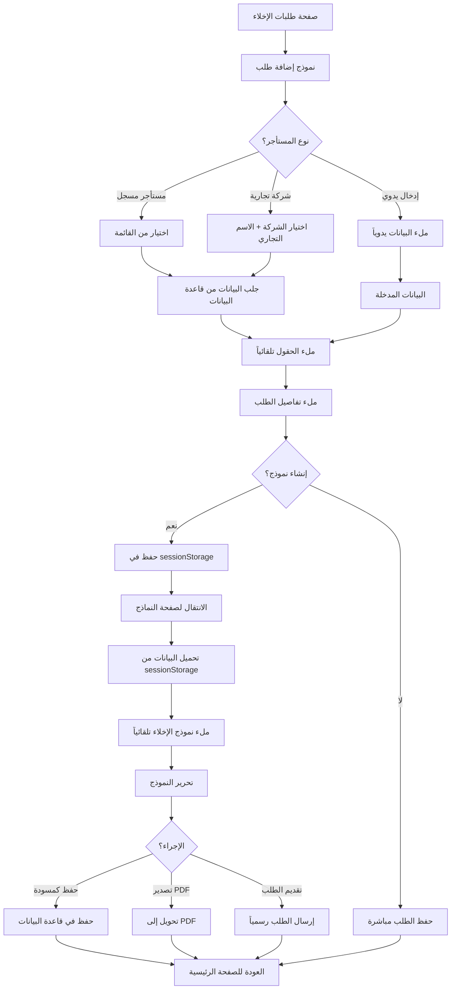

# سيناريو إضافة طلب إخلاء جديد 📋

## نظرة عامة
هذا المستند يوضح السيناريو الكامل لإضافة طلب إخلاء جديد في نظام EstateFlow، بدءاً من اختيار المستأجر وحتى إنشاء الطلب النهائي.

---

## 🔄 التدفق الكامل (User Flow)

### **الخطوة 1: الدخول إلى صفحة طلبات الإخلاء**
```
المسار: http://localhost:5000/dashboard/legal/eviction
```

**الإجراء:**
- المستخدم يضغط على زر "إضافة طلب إخلاء جديد" / "Add New Eviction Request"
- يظهر نموذج منبثق (Dialog)

---

### **الخطوة 2: اختيار نوع المستأجر**

**الخيارات المتاحة:**

#### **أ) مستأجر مسجل (Tenant)**
```typescript
payeeType: 'tenant'
```
- المستخدم يختار من قائمة المستأجرين المسجلين في النظام
- البحث: يمكن البحث بالاسم أو البريد الإلكتروني
- عند الاختيار: يتم جلب جميع البيانات تلقائياً

**البيانات المجلوبة تلقائياً:**
```typescript
{
  tenantName: string,      // اسم المستأجر
  propertyName: string,    // اسم العقار
  unitNumber: string,      // رقم الوحدة
  leaseId: string,         // معرف عقد الإيجار
  leaseEndDate: Date,      // تاريخ انتهاء العقد
  monthlyRent: number,     // الإيجار الشهري
  email: string,           // البريد الإلكتروني
  phone: string,           // رقم الهاتف
  nationality: string,     // الجنسية
  idNumber: string,        // رقم الهوية
  idType: string           // نوع الهوية
}
```

#### **ب) شركة تجارية (Business/Commercial)**
```typescript
payeeType: 'tenant' + businessName selection
```
- المستخدم يختار شركة تجارية
- يظهر خيار اختيار "الاسم التجاري" / "Business Name"
- عند الاختيار: يتم جلب بيانات الشركة والعقد

**البيانات المجلوبة تلقائياً:**
```typescript
{
  tenantName: string,          // اسم ممثل الشركة
  businessName: string,        // الاسم التجاري للشركة
  propertyName: string,        // اسم العقار
  unitNumber: string,          // رقم الوحدة
  leaseId: string,            // معرف عقد الإيجار
  leaseEndDate: Date,         // تاريخ انتهاء العقد
  monthlyRent: number,        // الإيجار الشهري
  trn: string,                // الرقم الضريبي
  licenseNumber: string,      // رقم الرخصة التجارية
  contactPerson: string,      // شخص الاتصال
  email: string,              // البريد الإلكتروني
  phone: string               // رقم الهاتف
}
```

#### **ج) إدخال يدوي (Manual Entry)**
```typescript
payeeType: 'manual'
```
- المستخدم يدخل جميع البيانات يدوياً
- لا يتم جلب أي بيانات تلقائياً

---

### **الخطوة 3: ملء تفاصيل طلب الإخلاء**

**الحقول المطلوبة:**

```typescript
interface EvictionRequest {
  // بيانات المستأجر (من الخطوة 2)
  tenantId?: string,
  tenantName: string,
  businessName?: string,
  
  // بيانات العقار
  propertyName: string,
  unitNumber: string,
  
  // تفاصيل الطلب
  reason: string,              // سبب الإخلاء
  dueAmount: number,           // المبلغ المستحق
  submittedDate: Date,         // تاريخ تقديم الطلب
  description: string,         // وصف الحالة
  
  // حالة الطلب
  status: 'Pending' | 'In Progress' | 'Approved' | 'Rejected',
  
  // معلومات إضافية
  courtCaseNumber?: string,    // رقم القضية
  hearingDate?: Date,          // تاريخ الجلسة
  documentUrl?: string         // رابط المستند
}
```

**أسباب الإخلاء الشائعة:**
- عدم دفع الإيجار (Non-payment of rent)
- انتهاء مدة العقد (Lease expiration)
- انتهاك شروط العقد (Breach of lease terms)
- استخدام غير مصرح به (Unauthorized use)
- أضرار في الممتلكات (Property damage)
- أخرى (Other)

---

### **الخطوة 4: الانتقال إلى نموذج طلب الإخلاء**

**السيناريو المقترح:**

#### **4.1: زر "إنشاء نموذج رسمي" (Generate Official Petition)**
```typescript
<Button 
  onClick={() => {
    // حفظ البيانات مؤقتاً
    sessionStorage.setItem('evictionDraft', JSON.stringify(evictionData));
    
    // الانتقال إلى صفحة النماذج
    router.push('/dashboard/legal/petition-templates?type=eviction&draft=true');
  }}
>
  إنشاء نموذج رسمي
</Button>
```

#### **4.2: صفحة النماذج تستقبل البيانات**
```typescript
// في petition-templates-client.tsx

useEffect(() => {
  const searchParams = new URLSearchParams(window.location.search);
  const type = searchParams.get('type');
  const isDraft = searchParams.get('draft');
  
  if (type === 'eviction' && isDraft === 'true') {
    const draftData = sessionStorage.getItem('evictionDraft');
    if (draftData) {
      const evictionData = JSON.parse(draftData);
      autoFillEvictionTemplate(evictionData);
    }
  }
}, []);

function autoFillEvictionTemplate(data: EvictionRequest) {
  // ملء النموذج تلقائياً بالبيانات
  const template = evictionPetitionTemplate;
  
  template.replace('[اسم المستأجر]', data.tenantName);
  template.replace('[العقار]', data.propertyName);
  template.replace('[الوحدة]', data.unitNumber);
  template.replace('[السبب]', data.reason);
  template.replace('[المبلغ المستحق]', data.dueAmount.toString());
  template.replace('[التاريخ]', formatDate(data.submittedDate));
  
  // إذا كانت شركة تجارية
  if (data.businessName) {
    template.replace('[الاسم التجاري]', data.businessName);
  }
  
  setEditorContent(template);
}
```

---

### **الخطوة 5: تحرير وتخصيص النموذج**

**في صفحة النماذج:**
```
http://localhost:5000/dashboard/legal/petition-templates?type=eviction&draft=true
```

**الإجراءات المتاحة:**
1. ✏️ **تحرير النص:** المستخدم يمكنه تعديل أي جزء من النموذج
2. 📝 **إضافة تفاصيل:** إضافة معلومات إضافية حسب الحاجة
3. 🎨 **تنسيق النص:** تطبيق التنسيقات (عريض، مائل، قوائم)
4. 📎 **إرفاق مستندات:** رفع مستندات داعمة
5. 💾 **حفظ كمسودة:** حفظ النموذج للعودة إليه لاحقاً
6. 📄 **تصدير PDF:** تحويل النموذج إلى PDF
7. ✅ **تقديم الطلب:** إرسال الطلب رسمياً

---

### **الخطوة 6: حفظ وتقديم الطلب**

#### **أ) حفظ كمسودة**
```typescript
await handleSaveEvictionDraft({
  ...evictionData,
  templateContent: editorContent,
  status: 'Draft'
});
```

#### **ب) تقديم الطلب النهائي**
```typescript
await handleSubmitEvictionRequest({
  ...evictionData,
  templateContent: editorContent,
  status: 'Pending',
  submittedBy: loggedInEmployee.id,
  submittedDate: new Date()
});
```

---

## 📊 مثال عملي كامل

### **السيناريو:**
> مالك عقار يريد إخلاء مستأجر لعدم دفع الإيجار لمدة 3 أشهر

### **الخطوات التفصيلية:**

#### **1. فتح صفحة الإخلاء**
```
المستخدم → قائمة القانونية → طلبات الإخلاء
```

#### **2. الضغط على "إضافة طلب جديد"**
```
زر: [+ إضافة طلب إخلاء]
```

#### **3. اختيار المستأجر**
```typescript
// النموذج المنبثق
{
  payeeType: 'tenant',
  selectedTenant: {
    id: 'tenant-001',
    name: 'أحمد محمد السالم',
    property: 'فيلا الشاطئ الذهبي',
    unit: 'A-101',
    monthlyRent: 5000,
    email: 'ahmed@example.com',
    phone: '+971501234567'
  }
}
```

**البيانات المجلوبة تلقائياً:**
```
✓ اسم المستأجر: أحمد محمد السالم
✓ العقار: فيلا الشاطئ الذهبي
✓ الوحدة: A-101
✓ الإيجار الشهري: AED 5,000
✓ رقم الهاتف: +971501234567
✓ البريد الإلكتروني: ahmed@example.com
```

#### **4. ملء تفاصيل الطلب**
```typescript
{
  reason: 'عدم دفع الإيجار',
  dueAmount: 15000,  // 3 أشهر × 5000
  submittedDate: '2025-10-08',
  description: 'المستأجر لم يدفع الإيجار لمدة 3 أشهر متتالية (يوليو، أغسطس، سبتمبر 2025) على الرغم من الإنذارات المتعددة'
}
```

#### **5. الانتقال لإنشاء النموذج**
```
المستخدم → [إنشاء نموذج رسمي]
↓
النظام يحفظ البيانات في sessionStorage
↓
الانتقال إلى: /dashboard/legal/petition-templates?type=eviction&draft=true
```

#### **6. النموذج التلقائي المُنشأ**
```
بسم الله الرحمن الرحيم

إلى: المحكمة المختصة
التاريخ: 8 أكتوبر 2025

الموضوع: طلب إخلاء مستأجر

السادة/ المحترمون،

نتقدم إليكم بطلب إخلاء المستأجر التالي بياناته:

الاسم: أحمد محمد السالم
العقار: فيلا الشاطئ الذهبي
الوحدة: A-101
الإيجار الشهري: 5,000 درهم إماراتي

سبب طلب الإخلاء:
عدم دفع الإيجار

المبلغ المستحق: 15,000 درهم إماراتي

تفاصيل الحالة:
المستأجر لم يدفع الإيجار لمدة 3 أشهر متتالية (يوليو، أغسطس، سبتمبر 2025) 
على الرغم من الإنذارات المتعددة المرسلة إلى:
- البريد الإلكتروني: ahmed@example.com
- رقم الهاتف: +971501234567

نرجو من سيادتكم التكرم بإصدار الأمر بإخلاء المستأجر المذكور.

وتفضلوا بقبول فائق الاحترام،
[توقيع المالك]
```

#### **7. التحرير والتخصيص**
```
المستخدم يمكنه:
✓ تعديل أي نص
✓ إضافة تفاصيل إضافية
✓ إرفاق مستندات (عقد الإيجار، إثباتات التواصل، إلخ)
✓ حفظ كمسودة أو تقديم الطلب
```

#### **8. التقديم النهائي**
```typescript
POST /api/legal/eviction/submit
{
  tenantId: 'tenant-001',
  tenantName: 'أحمد محمد السالم',
  propertyName: 'فيلا الشاطئ الذهبي',
  unitNumber: 'A-101',
  reason: 'عدم دفع الإيجار',
  dueAmount: 15000,
  description: '...',
  templateContent: '...', // المحتوى النهائي المعدل
  status: 'Pending',
  submittedBy: 'employee-001',
  submittedDate: '2025-10-08T10:30:00Z',
  documents: ['invoice1.pdf', 'warning-email.pdf']
}
```

---

## 🔄 التدفق التقني (Technical Flow)



---

## 📋 الحقول المطلوبة في قاعدة البيانات

### **جدول: eviction_requests**
```sql
CREATE TABLE eviction_requests (
  id VARCHAR(36) PRIMARY KEY,
  
  -- بيانات المستأجر
  tenant_id VARCHAR(36),
  tenant_name VARCHAR(255) NOT NULL,
  business_name VARCHAR(255),
  
  -- بيانات العقار
  property_name VARCHAR(255) NOT NULL,
  unit_number VARCHAR(50),
  lease_id VARCHAR(36),
  
  -- تفاصيل الطلب
  reason VARCHAR(100) NOT NULL,
  due_amount DECIMAL(10, 2),
  description TEXT,
  
  -- محتوى النموذج
  template_content TEXT,
  
  -- حالة الطلب
  status ENUM('Draft', 'Pending', 'In Progress', 'Approved', 'Rejected') DEFAULT 'Pending',
  
  -- معلومات إضافية
  court_case_number VARCHAR(50),
  hearing_date DATE,
  document_url VARCHAR(255),
  
  -- بيانات التتبع
  submitted_by VARCHAR(36) NOT NULL,
  submitted_date DATETIME NOT NULL,
  updated_at DATETIME,
  created_at DATETIME DEFAULT CURRENT_TIMESTAMP,
  
  -- مفاتيح خارجية
  FOREIGN KEY (tenant_id) REFERENCES tenants(id),
  FOREIGN KEY (lease_id) REFERENCES leases(id),
  FOREIGN KEY (submitted_by) REFERENCES employees(id)
);
```

---

## 🎯 نقاط مهمة

### ✅ **المميزات:**
1. **جلب تلقائي للبيانات** - يقلل من الأخطاء البشرية
2. **نماذج احترافية** - قوالب قانونية جاهزة
3. **مرونة في التحرير** - إمكانية تخصيص كل طلب
4. **تتبع كامل** - تسجيل جميع الإجراءات
5. **دعم الشركات** - معالجة خاصة للعقود التجارية

### 🔒 **الأمان:**
- ✓ التحقق من صلاحيات المستخدم
- ✓ تسجيل جميع الإجراءات (Audit Log)
- ✓ تشفير البيانات الحساسة
- ✓ نسخ احتياطية للنماذج

### 📱 **تجربة المستخدم:**
- ✓ واجهة بسيطة وسهلة الاستخدام
- ✓ ملء تلقائي للبيانات
- ✓ معاينة فورية للنموذج
- ✓ حفظ كمسودة في أي وقت
- ✓ إشعارات بالتقدم

---

## 🚀 التطوير المستقبلي

### **مقترحات للتحسين:**
1. **توقيع إلكتروني** - إضافة إمكانية التوقيع الرقمي
2. **إشعارات تلقائية** - إرسال إشعارات للمستأجر عبر البريد/SMS
3. **تتبع القضايا** - ربط مع نظام المحاكم الإلكتروني
4. **تحليلات** - إحصائيات عن أسباب الإخلاء وأوقاتها
5. **قوالب متعددة** - قوالب مختلفة حسب نوع الإخلاء
6. **لغات متعددة** - دعم العربية والإنجليزية

---

## 📞 الدعم

للمزيد من المعلومات أو المساعدة، يرجى مراجعة:
- دليل المستخدم الكامل
- الوثائق التقنية
- فريق الدعم الفني

---

**آخر تحديث:** 8 أكتوبر 2025  
**الإصدار:** 1.0  
**الحالة:** ✅ نشط
